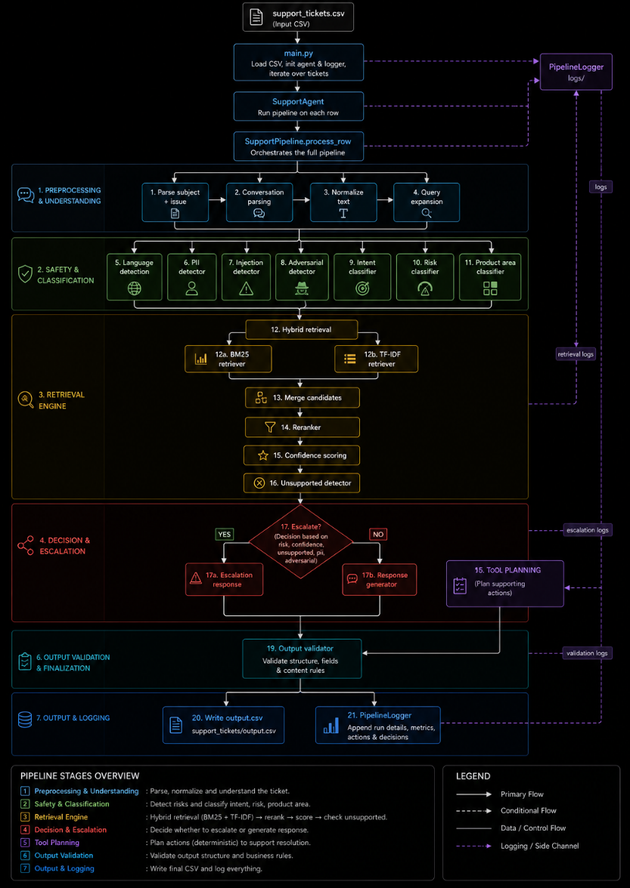
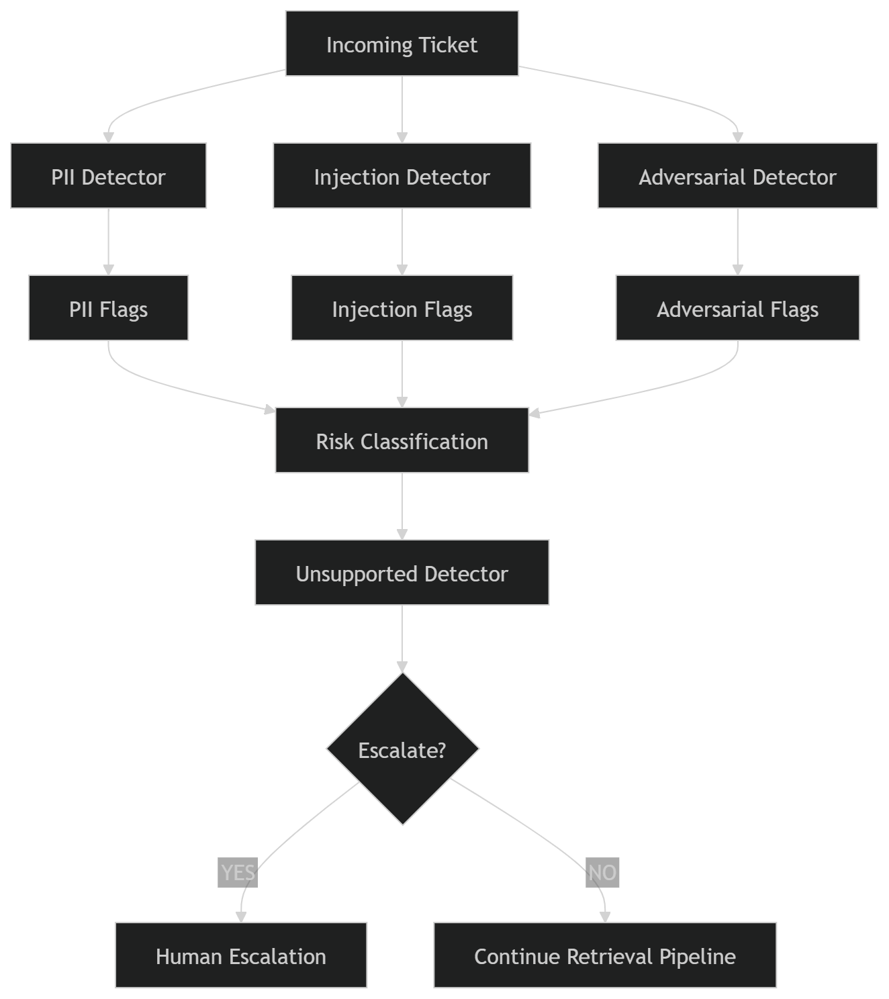
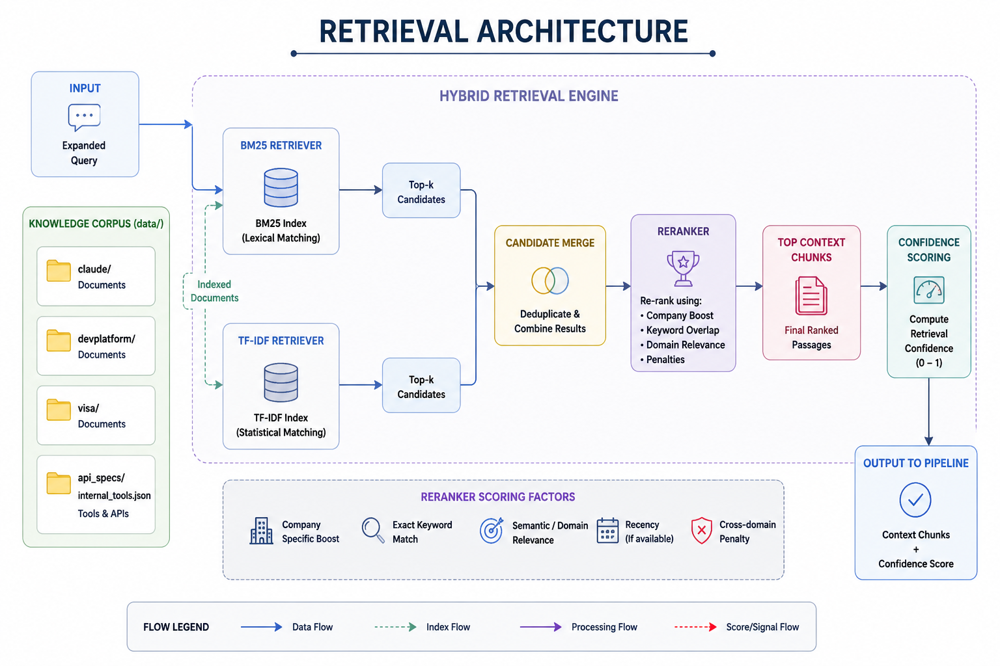

# Multi-stage Support Triage Agent — Architecture
## Overview
The Multi-stage Support Triage Agent is a safety-first support automation pipeline that processes customer support tickets using deterministic routing, hybrid retrieval, risk analysis, and controlled response generation.
The system reads support tickets from a CSV file, analyzes each ticket through multiple processing stages, retrieves supporting documentation from a local knowledge base, decides whether the request should be answered or escalated, and finally generates a structured output CSV.
The architecture is designed around four major goals:
* Safe automation
* Retrieval-grounded responses
* Deterministic behavior
* Auditability and traceability
---
# Repository Structure
Multi-stage-Support-Triage-Agent/
│
├── README.md
├── requirements.txt
│
├── code/
│   ├── main.py
│   ├── agent.py
│   ├── config.py
│   ├── pipeline.py
│   ├── validate_output.py
│   │
│   ├── classifiers/
│   ├── retrieval/
│   ├── safety/
│   ├── generation/
│   ├── tools/
│   ├── utils/
│   ├── evaluation/
│   ├── logs/
│   ├── tests/
│   └── ui/
│
├── data/
│   ├── claude/
│   ├── devplatform/
│   ├── visa/
│   └── api_specs/
│
└── support_tickets/
    ├── support_tickets.csv
    └── output.csv
---
# System Architecture

---
# Core Components
## 1. Entry Point — `main.py`
`main.py` is the primary execution layer of the system.
Responsibilities:
* Loads support tickets from `support_tickets.csv`
* Initializes the support agent and logger
* Processes tickets one-by-one
* Collects pipeline outputs
* Writes structured outputs to `output.csv`
---
# 2. Agent Layer — `agent.py`
The `SupportAgent` acts as a lightweight orchestration wrapper around the pipeline.
Responsibilities:
* Receives ticket rows
* Invokes `SupportPipeline.process_row()`
* Returns normalized outputs
The business logic is intentionally delegated to the pipeline layer.
---
# 3. Pipeline Layer — `pipeline.py`
`pipeline.py` is the central orchestration engine of the repository.
The pipeline executes the following stages:
1. Parse and normalize ticket content
2. Expand queries for retrieval
3. Run safety analysis
4. Detect PII and adversarial prompts
5. Classify request type and product area
6. Perform hybrid retrieval
7. Rerank retrieved context
8. Score retrieval confidence
9. Decide whether to escalate
10. Generate response or escalation message
11. Plan operational actions
12. Validate and return output
---
# Parsing and Normalization
## Files
* `parser.py`
* `utils/parsing.py`
Responsibilities:
* Parse conversation-style messages
* Normalize text formatting
* Extract latest user message
* Redact sensitive literals
* Handle malformed ticket formats
This stage converts inconsistent support tickets into a standardized internal representation.
---
# Query Expansion
## File
* `utils/query_expansion.py`
Responsibilities:
* Expand multilingual terms
* Add retrieval-friendly keywords
* Improve lexical retrieval recall
Example:
"payment failed"
→
"payment failed billing transaction issue"
---
# Safety Layer

## Folder
```text
code/safety/
```
The safety layer prevents unsafe or unsupported responses.
---
# Safety Components
## `pii_detector.py`
Detects sensitive information such as:
* Email addresses
* Phone numbers
* API keys
* Card-like numbers
* IP addresses
* Passport identifiers
---
## `injection_detector.py`
Detects prompt injection attempts including:
* instruction override attempts
* hidden prompt extraction
* data exfiltration requests
---
## `adversarial_detector.py`
Identifies:
* jailbreak patterns
* malicious phrasing
* unsafe prompt structures
---
## `unsupported_detector.py`
Flags:
* unsupported requests
* nonsense queries
* low-evidence requests
* out-of-domain questions
---
# Classification Layer
## Folder
```text
code/classifiers/
```
This layer routes requests into appropriate business categories.
---
## `intent_classifier.py`
Classifies ticket intent such as:
* bug report
* feature request
* account issue
* billing issue
* product issue
---
## `product_area_classifier.py`
Routes tickets into product domains:
* Claude
* Visa
* Developer Platform
This improves retrieval precision.
---
## `risk_classifier.py`
Assigns:
* low
* medium
* high
* critical
Critical or unsafe tickets are escalated automatically.
---
# Retrieval Layer
## Folder
```text
code/retrieval/
```
The repository uses a hybrid retrieval architecture combining BM25 and TF-IDF retrieval.
---
# Retrieval Architecture

---
# Retrieval Components
## `bm25.py`
Implements lexical BM25 ranking.
Optimized for:
* exact keywords
* product names
* error codes
---
## `indexer.py`
Builds indexes from the local corpus located in:
```text
data/
```
Also infers company ownership from file paths.
---
## `document_loader.py`
Splits large documents into overlapping chunks for retrieval.
---
## `hybrid.py`
Combines BM25 and TF-IDF retrieval results.
---
## `reranker.py`
Boosts:
* company-specific matches
* exact keyword overlap
* domain relevance
Penalizes:
* weak matches
* cross-domain contamination
---
## `confidence.py`
Computes retrieval confidence scores.
Low confidence results trigger escalation.
---
# Response Generation
## Folder
```text
code/generation/
```
The response generator produces the final support response.
---
# Response Modes
## Mode 1 — Escalation Response
Used when:
* adversarial content is detected
* risk is critical
* retrieval confidence is low
* requests are unsupported
---
## Mode 2 — LLM-backed Response
If `GOOGLE_API_KEY` is available:
* Uses Gemini (`gemini-2.5-flash`)
* Injects retrieved evidence
* Uses constrained prompting
---
## Mode 3 — Deterministic Fallback
If model generation fails:
* Builds grounded responses directly from retrieved chunks
This prevents pipeline failure.
---
# Tool Planning
## Folder
```text
code/tools/
```
---
## `tool_planner.py`
Reads:
```text
data/api_specs/internal_tools.json
```
Generates operational actions such as:
* reset_password
* verify_identity
* escalate_to_human
* lock_account
The planner is deterministic and rule-based.
---
# Logging System
## Folder
```text
code/logs/
```
The logging system provides foundational observability support.
Logs include:
* pipeline execution events
* retrieval events
* escalation decisions
* validation results
* action traces
The logger operates throughout the pipeline as a cross-cutting concern.
---
# Output Validation
## File
```text
validate_output.py
```
Validates generated outputs before submission.
Checks include:
* required columns
* valid status values
* confidence score ranges
* risk labels
* JSON formatting
---
# Evaluation Layer
## Folder
```text
code/evaluation/
```
Tracks evaluation metrics such as:
* retrieval accuracy
* escalation accuracy
* unsupported detection rate
* contamination rate
---
# Test Suite
## Folder
```text
code/tests/
```
Contains tests for:
* retrieval systems
* chunking
* multilingual handling
* safety systems
* adversarial detection
* pipeline execution
---
# Data Architecture
---
# End-to-End Workflow
1. Support tickets are loaded from `support_tickets.csv`
2. The pipeline parses and normalizes the issue
3. Safety detectors analyze the request
4. Request type and product area are classified
5. Hybrid retrieval searches the local knowledge base
6. Retrieved context is reranked
7. Confidence scoring evaluates retrieval quality
8. Unsafe or unsupported tickets are escalated
9. Safe tickets receive grounded responses
10. Operational actions are planned
11. Outputs are validated
12. Results are written to `output.csv`
---
# Architectural Characteristics
## Safety-First Design
Unsafe or uncertain requests are escalated rather than answered blindly.
---
## Retrieval-Grounded Responses
Responses are generated using local documentation rather than unrestricted generation.
---
## Deterministic Processing
The system relies heavily on:
* rules
* thresholds
* heuristics
* confidence scoring
This improves predictability and auditability.
---
## Modular Design
Each subsystem is isolated and independently extensible:
* safety
* retrieval
* generation
* evaluation
* logging
---
## Auditability
Logging and structured outputs make debugging and evaluation easier.
---
# Limitations
## Lexical Retrieval Limitations
BM25 and TF-IDF may miss semantic similarity.
---
## Heuristic Confidence Scoring
Confidence calibration is rule-based rather than learned.
---
## Limited Multilingual Support
Query expansion uses a small heuristic mapping.
---
## Corpus Dependency
Response quality depends on the quality of documents inside `data/`.
---
# Conclusion
The Multi-stage Support Triage Agent is a deterministic, retrieval-grounded support automation pipeline that combines:
* parsing
* safety enforcement
* classification
* hybrid retrieval
* reranking
* confidence scoring
* escalation logic
* response generation
* action planning
* output validation
into a structured and auditable support triage workflow.